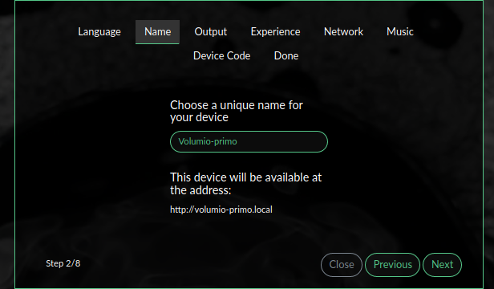
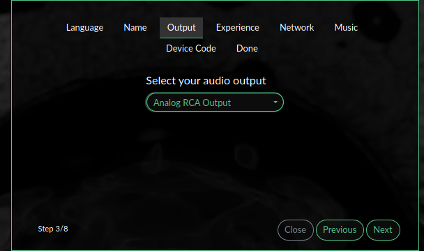
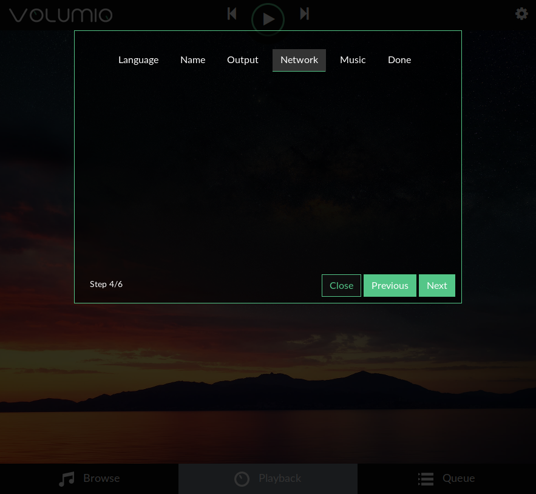
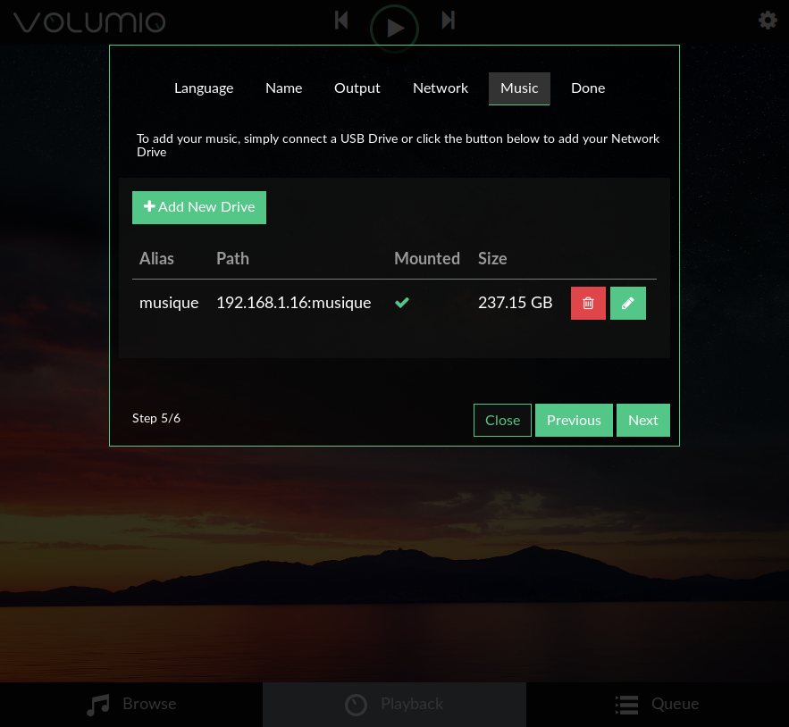
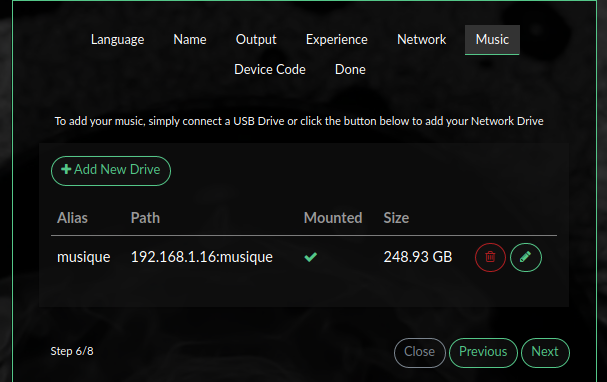

## Quick start guide

### DOWNLOAD AND INSTALLATION

* Please have look here to download a version for your device and instructions to flash it : <a href="https://volumio.org/get-started/">DOWNLOAD AND FLASH</a>

### FIRST BOOT

Volumio's first boot will take usually longer than normal, up to 6 minutes if you're on a Raspberry PI 1. Therefore, be patient on the first boot and wait about 5 minutes before starting to use Volumio.

The first boot takes longer because it is performing these setup steps:
- Extend the filesystem so it completely fills your SD Card / Hard drive
- Regenerate SSH keys, to make them unique to your device
- Install some packages and configure the system
- Generate new thumbnails for the default backgrounds

For security reasons, SSH is disabled by default on all versions after 2.199. It can be however enabled very easily. <a href="https://volumio.github.io/docs/User_Manual/SSH.html">INSTRUCTION HERE</a>

### NETWORK CONNECTION

* Volumio works best when it is connected to your network, since it is meant to be used as a headless device: no monitor connected, and controlled via another device (PC, smartphone, tablet etc)
* To connect Volumio to your network, simply attach an ethernet cable to it before starting it up
* If no ethernet is available, you can connect to its Hotspot (see below) and connect to your Wireless network. To do so, go to Settings -> Network and connect it from there
* *IMPORTANT* Do not configure your network manually via SSH, this can lead to issues and malfunctions

### VOLUMIO HOTSPOT

* If your device has wireless capabilities (and a supported Wireless card) Volumio will create a Wireless network called **Volumio**, the default password is **volumio2**
* The Hotspot mode will allow you to connect to your Wireless network without the need for a wired connection, just connect to Volumio Hotspot and configure your network in the Network options page
* Once your Wireless network has been configured, Valumio will automatically disable the Hotspot
* If, for whatever reason, your configured Wireless network is not available, Volumio will automatically re-enable the Hotspot
* You can change the Hotspot options in the Network options, such as its name, password and channel (useful if you experience poor Hotspot performance)
* Once in Hotspot Mode, Volumio can be reached with IP **192.168.211.1** or via **http://volumio.local** as usual

### CONTROL VOLUMIO WITH THE OFFICIAL APPS

* The most convenient way to control your Volumio system is through the official apps. The advantage is that they will automatically find your Volumio device on your network.
Not to mention that by getting the apps, you will help the project with a little contribution.

  

    

      
    

    

      
    

    

      
    

  

### WEB-UI CONNECTION

* The UI can be accessed from any device with a browser: Tablets, PC, Mac, Android Phones, iPhones, Smart TVs, Ebook readers etc. Make sure you have the latest versions of their respective browsers. For an optimal experience, Google Chrome is suggested.
* The UI can be accessed by typing Volumio's IP address in your browser. To find the IP address you can use:
- **ANDROID** [FING](https://play.google.com/store/apps/details?id=com.overlook.android.fing&hl=it)
- **iOS** [Net Analyzer](https://play.google.com/store/apps/details?id=net.techet.netanalyzerlite.an&hl=it)
- **Chrome** [mDNS Browser](https://chrome.google.com/webstore/detail/mdns-browser/kipighjpklofchgbdgclfaoccdlghidp)

* Volumio UI can also be accessed by typing [http://volumio.local](http://volumio.local), or if you renamed your Volumio device http://VOLUMIONAME.local .
  * Please note that this function is not available on Android devices, but should work on Mac and iOs or in Windows. For more details, see <a href="https://volumio.github.io/docs/Good_to_Knows/Finding_Volumio.html">Finding_Volumio</a>.

### WEB-UI ON HDMI DISPLAY OR RASPBERRY PI OFFICIAL TOUCH DISPLAY

Volumio can display its UI on any attached HDMI display.
* There is native support on the X86 Platform, just plug in a screen.
* On other platforms (Raspberry PI, UDOO, Odroid, Pine64 etc) the feature is disabled by default, for performance reasons.
* However you can enable it on these platforms by installing the "Touch Display" plugin
  * Please make sure there are no keyboards or mice connected to your Volumio device before installing the plugin. You can reattach them after installation.
  * To install the plugin, navigate to Settings -> Plugins, click on the "Miscellanea" category and install the "Touch Display" plugin. On some devices this might take up to 10 minutes.
  * After the plugin has successfully installed, enable it and you will see the UI on the HDMI connected display (or the official Rasperry PI display, if present)
  * After the plugin is installed, the web-UI will continue to work as normal
* If you choose not to install the plugin, once Volumio has finished booting you will see a login prompt, which is absolutely fine.

### FIRST CONNECTION TO THE WEB-UI

* Once the system is on and you have connected to it through your network or via the hotspot, you will reach Volumio's web-UI.
The first time, a helper will assist you to configure Volumio. Don't worry if you missed it, you can still configure it later !

* The helper first screen : Choose your LANGUAGE

* The helper second screen : Choose the NAME for your device

* The helper third screen : Configure your DAC

* The helper fourth screen : Configure your NETWORK

* The helper fifth screen with a configured NAS drive

* The helper sixth screen : Don't forget to donate ! It will help Volumio to be improved !

* Once it is done, you should have a working system, ready to play music! Let's discover it !
