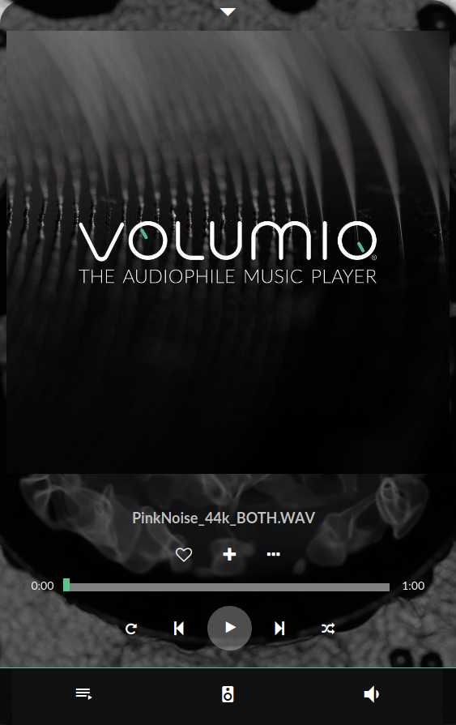
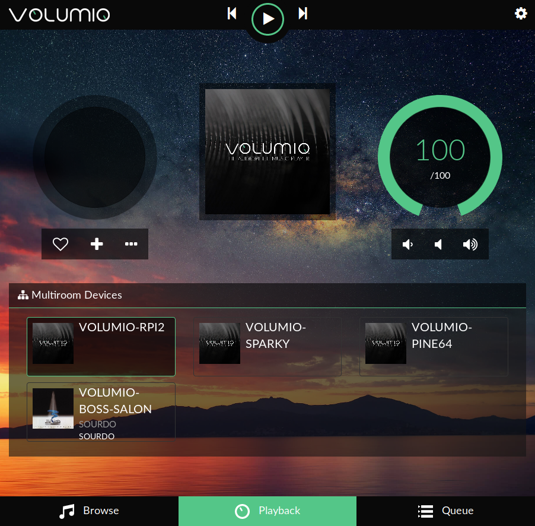
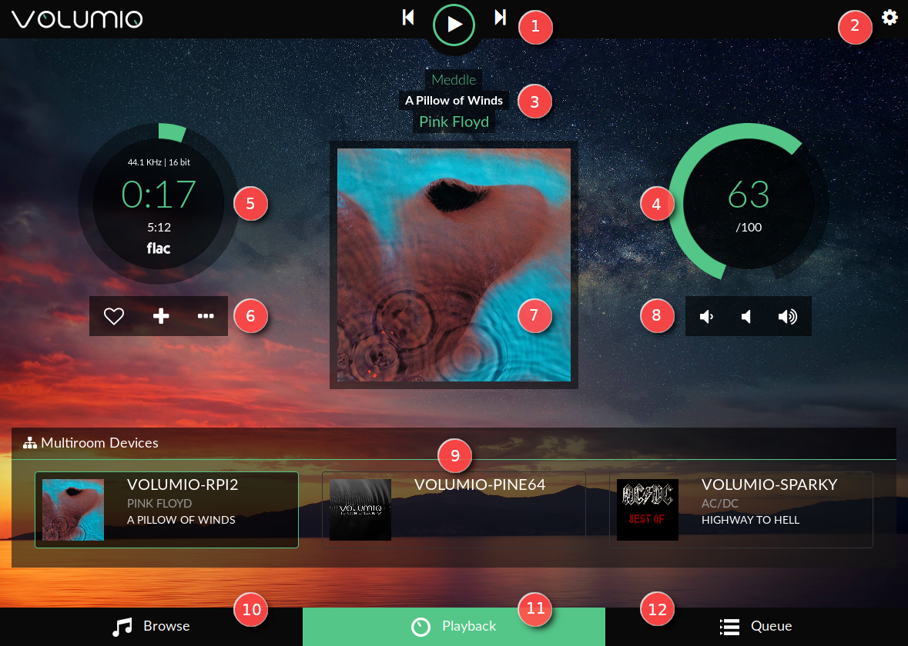

 ## First steps with Volumio

### Main webUI page

* Once your system is configured with the helper, you'll see the main page of Volumio
* Depending on the device you use to connect to Volumio, you'll see the desktop page or the mobile page.
* Both provide the same features, but the user interaction is slightly different (to best match the connected device)

_Mobile Main page of Volumio :_

_Desktop Main page of Volumio :_

### Main page description

_Desktop version_

#### 1 - Playback control buttons

* __Play/Stop__ : obvious...
* __Previous__ : jump to previous track
* __Next__ : jump to next track

#### 2 - Settings (gear icon)

Clicking this opens a menu containing all the settings for Volumio :

 * __My Volumio__ : Here you can access your MyVolumio account
 * __My Music__ : Music sources (NAS and USB devices) and album art management
 * __Playback__ : Output device settings (dac, mixer, resampling)
 * __Appearance__ : To select your language, image background or color
 * __Network__ : Set your WiFi, ethernet, DNS and control the Hotspot
 * __System__ : Name your device, check version number and update if available, reset your system, and see credits for Volumio
 * __Plugins__ : To add features to Volumio such as Streaming services (Spotify, etc), gpio management, equalizer, Internet radio ...
 * __Alarm__ : You love to wake up with your favorite music ? It's here!
 * __Sleep__ : You love listening to music before sleeping ? It's Here!
 * __Shutdown__ : To stop or reboot your device properly
 * __Help__ : Link to the online help
 * __Volumio Shop__ : Link to the Volumio shop where you'll find compatible and good-sounding hardware

#### 3 - Track info zone

Metadata for the currently playing track:

* __First line__ : Album name
* __Second line__ : Track title
* __Third line__ : Artist name

#### 4 - Volume control

* __Inside value__ : Current volume level
* __External circle__ : Graphic volume level. Change the volume by clicking on the arc.

#### 5 - Timer zone

Miscellaneous info about the currently playing track:

* __First line__ : Sample rate / bit resolution
* __Second line__ : Ellapsed time
* __Third line__ : Total duration
* __Fourth line__ : Track source

#### 6 - Track management controls

* __Left__ : Add to favorite
* __Middle__ : Add to playlist
* __Right__ : Go to - Artist/Album - Tweeter

#### 7 - Album art display

Display album art for the played track or webradio, if available.

#### 8 - Volume control buttons

* __Left__ : Lower volume
* __Middle__ : Mute
* __Right__ : Higher volume

#### 9 - Multiroom zone

This shows all the available Volumio devices on your network and what they are playing. In the picture, the device called VOLUMIO-RPI2 is the one you are currently connected to (it is highlighted). The VOLUMIO-PINE64 device is silent and the VOLUMIO-SPARKY device is playing something else. To connect to another device, click on it.

#### 10 - Browse

Clicking here shows all music available on your system (NAS, USB disk, webradio, Spotify, Youtube etc depending on plugins/options installed).

#### 11- Playback

The current page

#### 12 - Queue

Clicking here shows all the tracks currently queued to be played.

