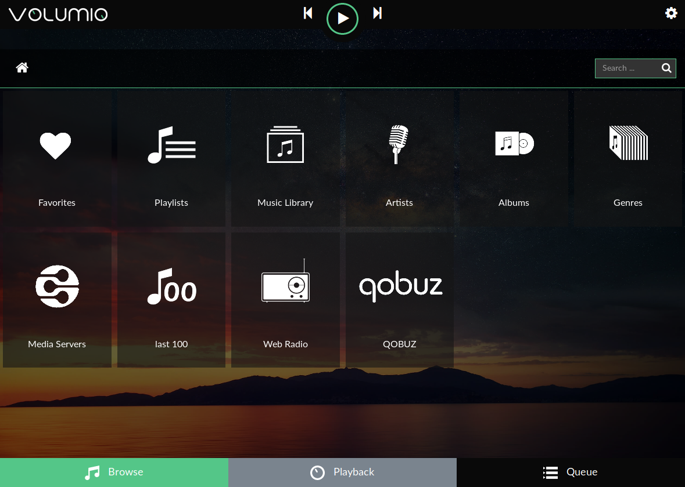
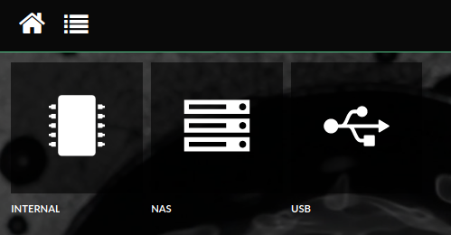
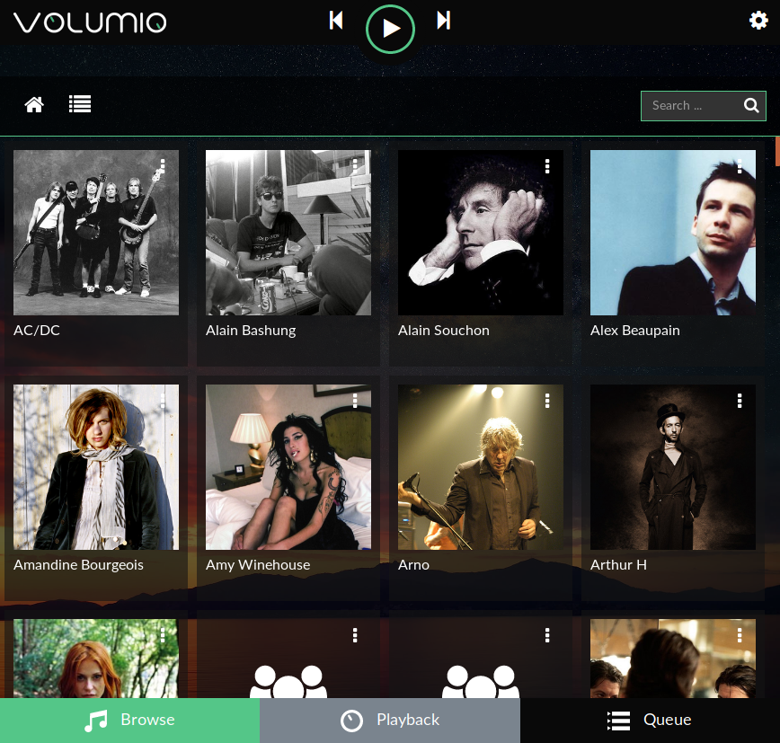
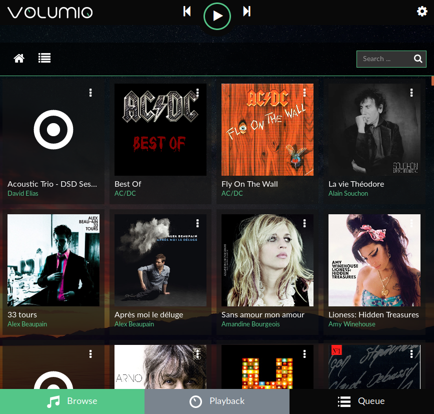
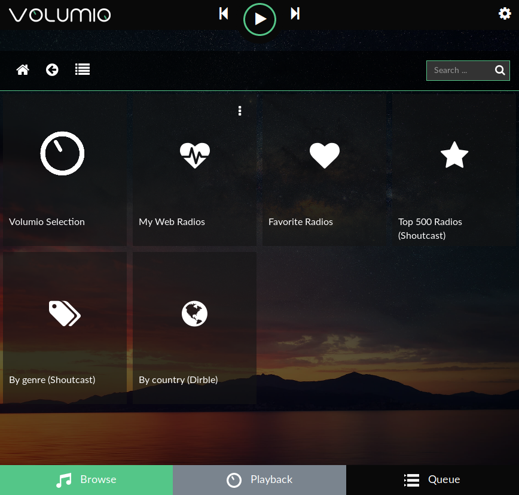
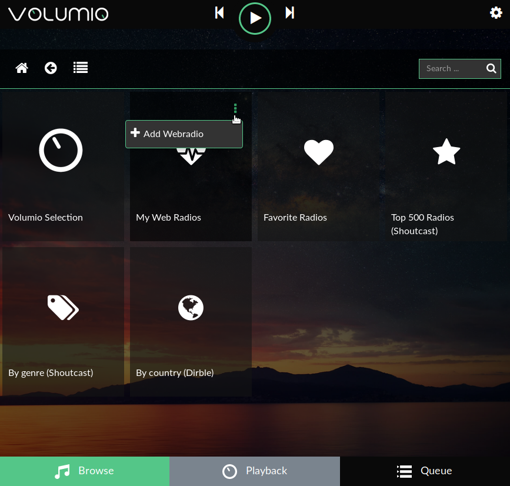
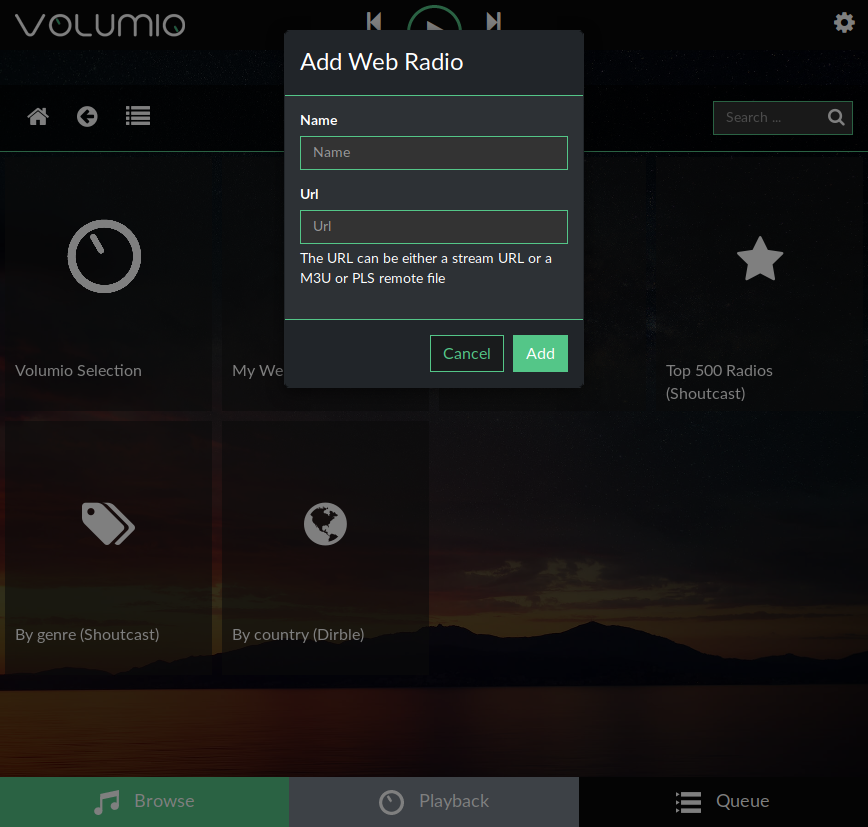
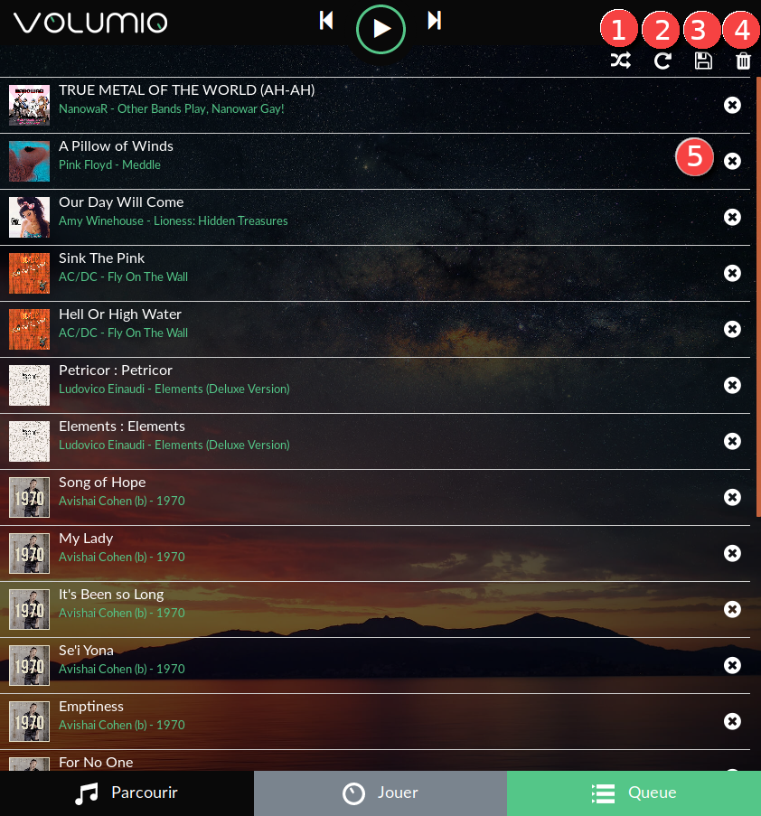

 ## More first steps

The Volumio main page provides 3 tabs:
 * Browse
 * Playback (main page)
 * Queue

We already discovered the Playback tab in the previous <a href="First_steps_with_Volumio.html">page</a>.
Now let's see the content of the __Browse__ tab and the __Queue__ tab.

### Browse tab

* Clicking on the Browse tab will display all the music sources available on your system, with several options to browse through them.

#### 1 - Favorites

* __Favorites__ : Access your favorite tracks

#### 2 - Playlists

* __Playlists__ : Access your Playlists

#### 3 - Music Library

* __Music Library__ : Access your music collection by storage device, folder and file

#### 4 - Artists

* __Artists__ : Access your library by artist name

#### 5 - Albums

* __Albums__ : Access your library by album title

#### 6 - Genres

* __Genres__ : Access your library by genres

#### 7 - Media server

* __Media server__ : Access any media servers (UPNP/DLNA, Airplay) on your network

#### 8 - Last 100

* __Last 100__ : List the last 100 tracks played

#### 9 - Web Radio

* __Web Radio__ : Access web radio. Volumio provides a large collection to select from,
* but you may add your own as well.

__Adding a radio__
* To add your own radio, click as shown below :

and fill in the fields :

Now your radio is available in My Web Radios

#### 10 - Other

* __Other__ : Depending on the plugins/options you have installed, you may have other items shown on the Browse page such as Spotify, Qobuz...

### Queue tab

* Clicking on the Queue tab will display the queue of the tracks that are going to be played
  and some queue controls.

#### 1 - Random

* __Randomize__ the order tracks are played

#### 2 - Repeat

* __Repeat__ the current track

#### 3 - Save

* __Save__ the current queue as a playlist. Volumio will ask you to name the new Playlist.

#### 4 - Clear queue

* __Clear__ the current queue

#### 5 - __Remove__ track

* __Remove__ track from the queue

__More features__

You can change the order of each track by clicking and moving it up or down.

This brings us to the end of our first exploration of Volumio.
Later pages in this guide give details about the more advanced features.
