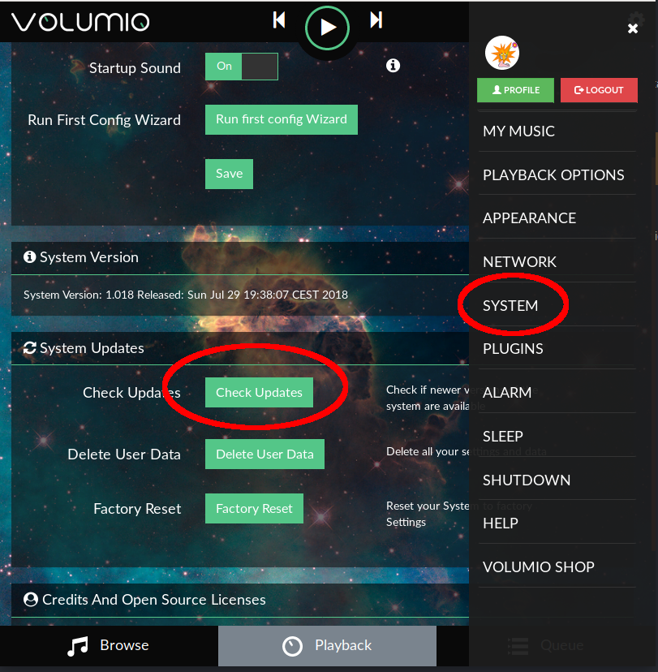
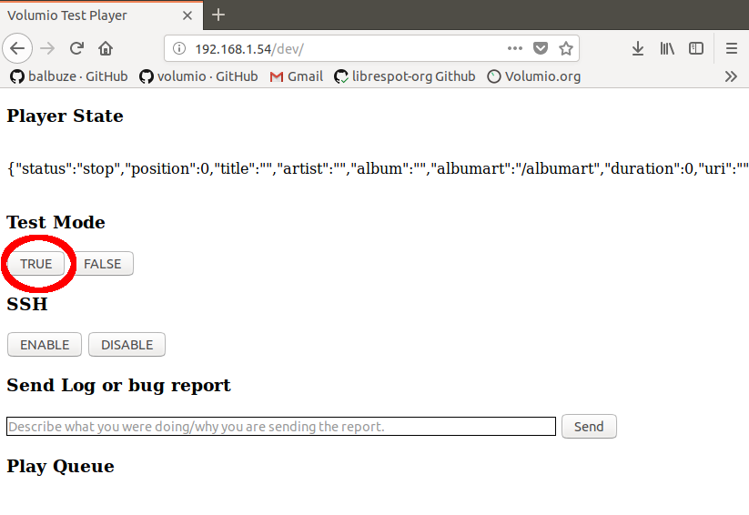

## Volumio OTA Updater

Volumio features an OTA (Over The Air) updater, meant to enable seamless and reliable upgrades to new system versions. It has these features:

* Cloud-based distribution: Volumio uses a cloud-based build mechanism for its images. It makes use of this for the updater control backbone as well
* 1:1 verified updates of new versions, this ensures that new updates are deployed exactly as they are built
* Differential download: instead of downloading the full firmware, Volumio will download just the differences between the current system and the new one. This can save up to 90% of download size, resulting also in faster downloads
* User-data preservation: updating to a new version will keep user data (such as playlists, music files, settings) untouched
* Ability to wipe user-data: doing so will reset all settings to factory defaults, while keeping the last firmware version installed.
* Ability to reset to factory settings: doing so will revert the system to the first version it was booted to. This will cancel both user data and newer system versions

### How to use the OTA updater

* Verify that your Volumio device is connected to the Internet
* Click on the cog-wheel in the top right part of the UI
* Select "System"
* Click on "Check Updates"
* If an update is available, you'll be presented with a description of the new features.
* Click on "Update Now"
* System update will start, and depending on the update size it might take up to 20 minutes
* Once Update has finished, you'll be asked to reboot. Do it
* The system will now restart, and boot into the new version

### Use the system updater to test Beta-Releases

* Volumio can also be updated to Beta Releases via the OTA Updater. Beta-releases are test builds of the system with new functionality
* Beta releases are meant to test new functionality before deploying an update to the entire Volumio userbase
* Beta releases might not work, or present bugs still to be solved. They are therefore meant for expert users willing to take the risk of losing all their data
* To receive beta-releases, the system has to be put in "TEST MODE". To do so, navigate to http://volumio.local/dev or http://yourvolumioip/dev
* Once in the /dev page, click on  "TRUE" on "TEST MODE" Section. Your device is now in TEST MODE, and will receive test updates from now on
* Follow the instructions above to update your system; the only difference is that you'll see the test releases instead of ordinary releases

__Note__ You'll see no change when clicking, but it's ok!

### Disable TEST MODE

* To disable test mode, navigate to /dev page and click "FALSE" on "TEST MODE" section.
* You will now receive only ordinary releases
* If you want to revert from your current test version to a previous stable release, do a factory reset and then update to latest stable version (this will erase all your data)

### When not to use the OTA Updater

If you're an advanced user and make manual changes to the system (e.g. manual changes of config files via SSH, update the volumio backend via `git` etc) , we strongly suggest __not__ to use the OTA updater, since your manual changes may conflict with the changes brought by the automated updates.
