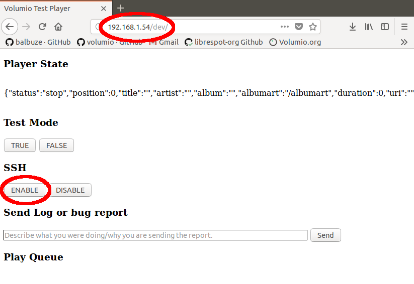

## SSH access on volumio

When SSH is activated on Volumio (see below how to) you can access your device using:

From __Windows__ : [Putty](https://putty.org/)

From __Linux__ : ssh command from a terminal

From MacOs [openssh](https://www.macupdate.com/app/mac/5675/openssh#)

Once it is ready, use to log in:

* user: volumio

* password: volumio

Example (linux) : `ssh volumio@192.168.1.54`

Type `Enter`. It returns:

`volumio@192.168.1.54's password:`

Type `volumio` (password, case sensitive) and `Enter`

And here you are !

From here you can get full access to your device.
Some commands require Root privileges. To do that use `sudo` with password `volumio`

example `sudo nano /etc/samba/smb.conf`

__WARNING!__  You can damage your __Volumio__ with `sudo`. Editing system files may prevent __Volumio__ to be updated over the air (integrity check will fail).

## How to enable SSH

For security reasons, SSH is disabled by default on all versions after 2.199 (except first boot). It can be however enabled very easily. See below!

### First method: DEV UI (easy)

Navigate to the DEV ui by pointing your browser to VOLUMIOIP/DEV or volumio.local/DEV . Find the SSH section, and click enable. From now on your SSH will be permanently enabled.

__Note__ : You'll see no change when clicking on the button, but it will be ok.

### Second method: file (more advanced)

Mount your SD card on your computer.

Create or copy a file called ssh in /boot . You can do it right after flashing Volumio, by creating it in the "Boot" partition of your SD Card.
