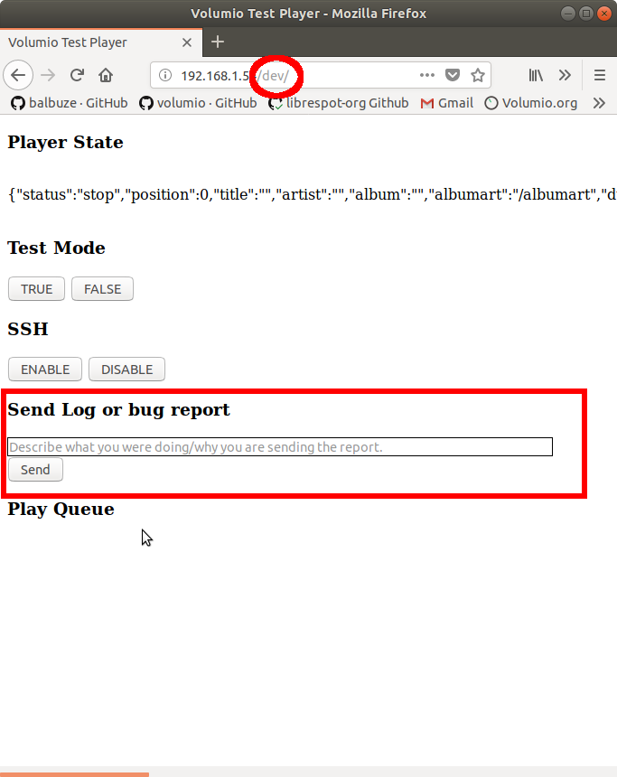

## Sending logs for Troubleshooting

When your Volumio device does not work as expected, crashes or fails in particular conditions, the only way to understand what goes wrong
is usually by looking at logs. So, if you experience such problems, please follow this guide to report your issue to developers.
Volumio features an integrated facility to collect logs of your system and publish them in a way to offer developers a clear way to understand
what is broken on your system.

### How to send a bug report

* Navigate to http://volumio.local/dev or http://yourvolumioip/dev, where 'yourvolumioip' is the actual IP addess of your device eg. 192.168.1.54

* This will open the "DEV" page
* Scroll until you see a section called "Send logs of bug report"
* Fill the text field with a clear, but short description of your problem
* Click on Send
* Once the logs have been successfully sent, you will see a link like "http://logs.volumio.org/xxxxxx"
* Press the copy button to copy the link to your logs in your clipboard

* Paste this log wherever you're requesting for help: a forum thread, a githhub issue or a mail
* If possible, write a very detailed step-to-step guide on how to replicate the problem
