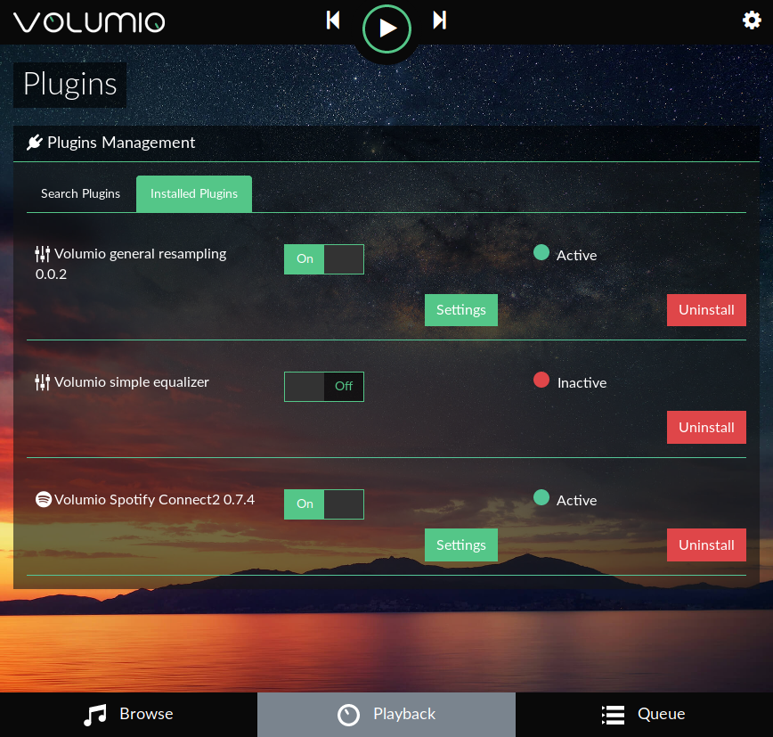

### Introduction

Volumio2 introduces the concept of plugins to expand its functionality, and allow an easy sharing of the tweaks and improvements usually generated by the community. We've worked hard to create a standardized layout to make it easier to develop any kind of plugin. If you feel that your particular use case is not covered, please open an issue or discussion at the plugins repo:

[https://github.com/volumio/volumio-plugins](https://github.com/volumio/volumio-plugins)

### What is plugin ?

A plugin is meant to add one specific functionality.
It could be music_service, system features, audio interface add on and almost everything developers (Volumio and community) can imagine.

There is two kinds of plugin :
* __Official plugin__ : Plugin approved by the Volumio team and available through the webUI plugins page.
* __Unofficial plugin__ : Not (yet) approved plugin. Most of the time from the community. For advanced users only and for testing. Requires some command line to be installed. It's better to wait for it to be approved...

### How to install an official plugin ?

Plugins can be installed via Volumio's UI, by selecting the "Plugins" menu entry :


From there you will be able to browse the Online Plugin Repository :


Select the plugin you want to install by clicking __install__ on the right side.

Once installed, you have to click on __Installed plugins__ tab and enable it :



Depending on the plugin, you may have to go in __Settings__ for the plugin to enter credentials (Spotify), set the GPIO or Equalizer.

### How to install an unoffical plugin ?

__Warning__: Even if installing an unofficial plugin won't burn your house or kill your dog, it can result as an unstable system, or non functionnal and you may have to reset or reflash your SD card and loose your settings. So it is reserved to advanced user, to test or help the dev.

Once it is said, this is how to proceed. In the example, we are going to install [volprametriceq](https://github.com/balbuze/volumio-plugins/tree/master/plugins/audio_interface/volparametriceq), a Parametric Equalizer.  Of course, for another plugin, you have to adapt the path and the name of the plugin:

* __1)__ Activate SSH on your system : [SSH](https://volumio.github.io/docs/User_Manual/SSH.html)

* __2)__ Connect to your device via your console (linux) or Putty (Windows)

* __3)__ Download the plugin:

 `wget https://github.com/balbuze/volumio-plugins/raw/master/plugins/audio_interface/volparametriceq/volparametriceq.zip`.


 * __4)__ Now create a temporary folder
 `mkdir ./volparametriceq`

 * __5)__ Unzip the previously downloaded file
 `miniunzip volparametriceq.zip -d ./volparametriceq`

 * __6)__ Go to this folder
 `cd ./volparametriceq`

 * __7)__ Install the plugins
 `volumio plugin install` and __wait__. It can last several minutes if a lot of packages need to be download. Then :

 * __8)__ Remove all temporary files :
 `cd ..`
 `rm -Rf volparametriceq`

 * __9)__ In the webUI, go to installed plugins section and enable the plugin.

 * __10)__ If required, go in the plugin settings.


 __Enjoy !__


### Technical overview of a plugin

It is provided as zip file which contains all needed files for it to work, either directly included in the zip file or available via a an install script that will download them automatically.

Plugins are located under

```
/data/plugins/
```

And they are organized in subfolder per categories. When installing plugin, a folder is created in:

```
/data/plugins/mycategory/myplugins
```

All plugins related files (extracted from zip and resulting from install sh script will be found here).

### Existing Plugin Categories

PLEASE NOTE: Categories name must be lowercase and separated by _ .

#### audio_interface

This typically collects plugins that add an audio interface, aka an external and not browsable music source. Typical examples are:
* Airplay
* UpNp
* Bluetooth
* Equalizer, DSP...

##### music_service

Those are browsable music sources, typically:
* MPD (for local files)
* Webradios Directories
* Streaming Services like Spotify

#### miscellanea

Those plugins that are too general purpose to classify. Furthermore they are meant to work as standalone units, and they don't require interaction with other plugins. Examples:

* Appearance Plugins

#### system_controller

Those are usually core-plugins, meant to handle vital parts of Volumio.

* Networking
* Network Attached Storage
* Core updater services

#### user_interface

Those plugins are meant to allow external communication to Volumio. Developing a new one will be useful to add API Rest Capability, or to extend Volumio interoperability with third party apps and controllers. Some examples:

* MPD Client Protocol emulation
* Squeeze Box emulation
* Phisical button controller

### What features can be added

This features could be miscellaneous, such as new online music provider, new radio stream, management of the GPIO (for supported devices), various DSP, display and plenty of other useful things ! The only limitation is your imagination !


A good way to understand how is made a plugin, is to browse /volumio/app/plugins folder and /data/plugins folder. You’ll find inspiration for your own dev !

### Plugin Configuration files

While first start, Volumio will create a folder that contains saved parameter in a config.json stored in:

```
/data/configuration/mycategory/myplugins
```

### The plugins.json file

The plugins.json file stores the status of core (found in /volumio/app/plugins/plugins.json folder) and extra (found in /data/plugins/plugins.json ) plugins.

**IMPORTANT** : If you create a new plugin MANUALLY, you MUST add a plugin reference to plugins.json files (in /data/plugins/plugins.json). If such reference is not found, volumio will automatically delete your plugin folder.

The plugins json contains informations on plugins status:
- Enabled, which can be true or false
- Started, which can be true or false

Add your information under your plugin relevant category. For example, if I'm adding a music_service plugin called "google_music", the relevant section will look like

```
{
  "music_service": {
    "google_music": {
      "enabled": {
        "type": "boolean",
        "value": true
      },
      "status": {
        "type": "string",
        "value": "STARTED"
      }
    },
    ...
```
