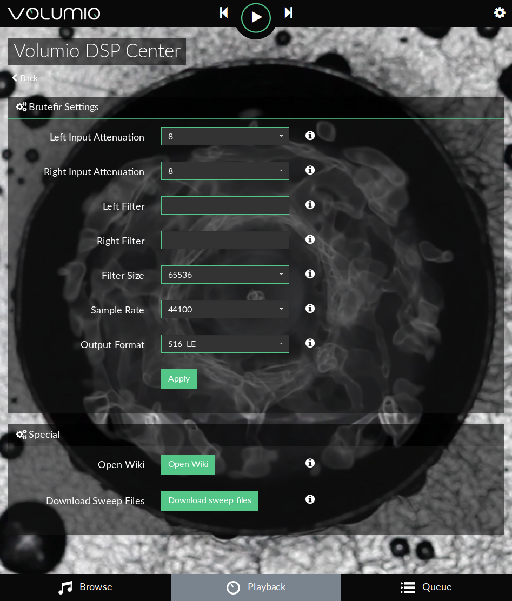
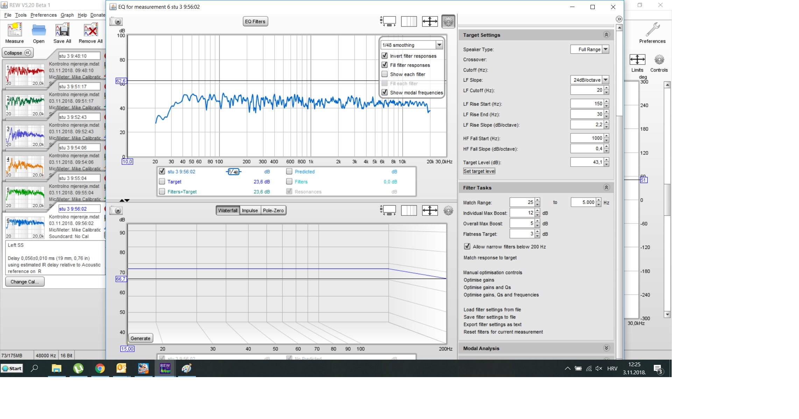

## Create your own filters

There is 4 important steps to that :

* playing sweep file (with Volumio)
* Recording signal while playing (with REW)
* Modifing the result (with REPHASE) and generating filters.
* Using this filter in Volumio trough the Brutefir plugin.

### Sweep files

To make it easy, the plugin can provide these files.
These wav file contain a 20Hz to 20000kHz signal plus a time reference signal.
In the plugin settings, click on `Download sweep files`

Wait, and now you have 3 new files on your system!
TO see them, go in the BROWSE tab of Volumio
Now go in `Music Library`,`INTERNAL`,`brutefirfilters`,`sweep`

### Measurment

Now, plug your Microphone on your computer, and place it where you should be to listen music. The placement is important, and you're advised to read some howto...

Launch REW (roomeqwizard)

Before measuring, some adjustement are needed :

* Configure mic calibration as below :

* Then, ajust parameters for input and output :

* Configure Make a measurement parameters :

* When ready, hit Start measuring a wait for in the message `Waiting for time reference`

Now, play the first sweep file for the channel you are measuring (Left or Right)

* Once it is done, in REW, in EQ windows under settings (icon in upper right corner) choose 1/48 smoothing

-        choose File/Export/Export measurement as text (this file will be imported in rePhase)

* Repeat the same for the other channel

### Now you are ready for the next step : Create your filters !
