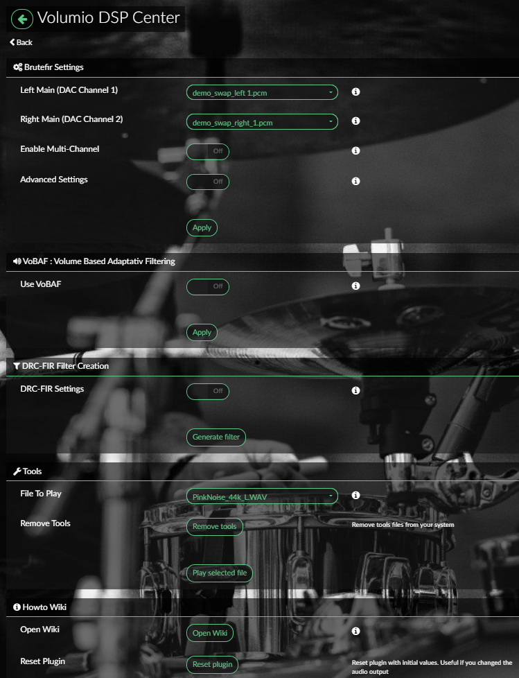
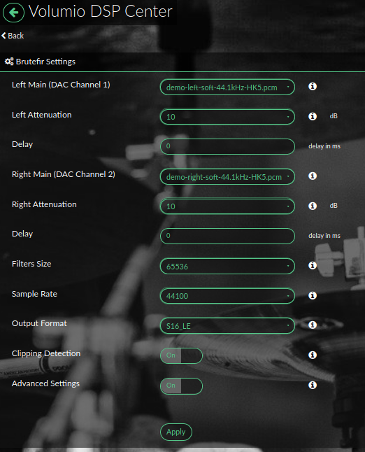
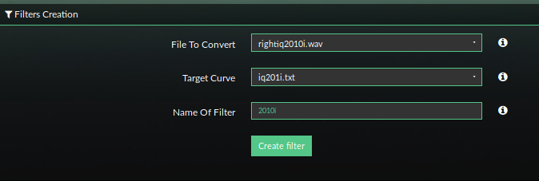

## Preparing Your system

To start install the plugin following the instructions on the [ : Brutefir Git-hub](https://github.com/balbuze/volumio-plugins/tree/master/plugins/audio_interface/brutefir3) page. Then follow the following instructions:

1. Once the plugin is installed, enabled it wait about 20 sec. Don't try to make any change in Volumio playback. 
2. The plugin will prompt you to reboot in order to perform hardware detection. Most of the time, a __reboot__ is required to get good values.
3. After a reboot try to play a track, if the music is playing, go to the next step.
    - If an error occurs go in plugin settings and try to change __Output Format__ and __Sample Rate__. These are DAC dependant parameters.
4. You can now test with a filter, just select __demo-left.pcm__ and __demo-right.pcm__ in plugin settings: (a few filters to test are installed by the plugin, they are placed in `/data/INTERNAL/Dsp/filters`) and press `Apply`. This can be done while playing. You should hear the difference. 
    - __Important:__ Applying filters will display a prompt to Test Clipping and set Attenuation. This is done by playing full volume pink noise. If your DAC support a volume mixer, it should be mute. In other case  __Turn down your volume before pressing `Test`__

### Now, let's see how to create your own filter, just designed for your hardware and room!
Go to [next page](02_Making_Measurment.md). 

---
## Interface screenshots

__Main Interface of the plugin__

__Filter Advanced Settings__

__VoBAF settings (optional)__

__Filter Creation (described in the following pages)__

__Tools (described in the following pages)__

