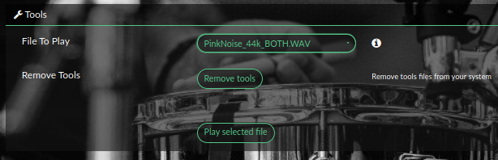
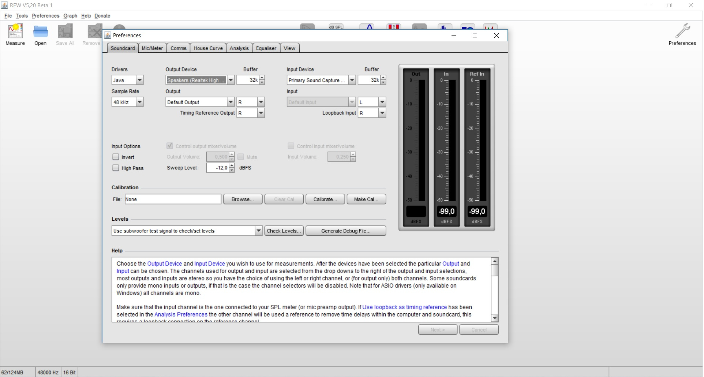

## Create your own filters

There is 4 important steps to that :

* playing sweep file or pink noise using Tools in the plugin.
* Recording signal while playing (with REW)
* Modifing the result (with REPHASE) and generating filters.
* Using this filter in Volumio trough the Brutefir plugin.

### Tools in Volumio

To help to generate your filter, the plugin can provide some tools.

__Sweep files__

These wav file contain a 20Hz to 20000kHz signal plus a time reference signal.

__Pink noise files__

Provide pink noise files.

__Tools__ are not installed by default. If you need to install, press install tools in the plugin and wait the windows to be refreshed.

After the page is refreshed, you'll new entries in the page of the plugin.

### Measurment

We will describe a method called MMM - Moving Mic Measurment.

The idea is to make a multi point measurement and use the average of these measures.

MMM (or RTA as called in REW) is reliable up to app __600Hz__, and that is anywway the area where most of the problems are.

For the freqs above 600Hz you should use __single point__ (at your listening position) time gated sweep measurement.

Read more about moving microphone method (implemented via RTA in REW) here:
<a href="http://www.ohl.to/audio/downloads/MMM-moving-mic-measurement.pdf"> : MMM</a>

Measurment points are defined like in above pictures

It avoids to have a single optimized listening point

### Let's go !

Now, plug your Microphone on your computer, and place it where you should be to listen music. The placement is important, and you're advised to read some howto...

Launch REW (roomeqwizard)

Before measuring, some adjustement are needed :

* Configure mic calibration as below :

* Then, ajust parameters for input and output :

### Now let's use sweep files

* Configure Make a measurement parameters :

* When ready, hit Start measuring a wait for in the message `Waiting for time reference`

Now, play the first sweep file for the channel you are measuring (Left or Right)

* Once it is done, in REW, in EQ windows under settings (icon in upper right corner) choose 1/48 smoothing

-        choose File/Export/Export measurement as text (this file will be imported in rePhase)

* Repeat the same for the other channel

### And then Pink Noise files

In REW, clic on RTA icon. It will open a new windows. Then clic on the gear (right top side corner and set the following parameters

  

When ready, in the plugin press "play left channel" pink noise. In REW, press the record button (top right)

Move your Mic following the scheme above.

These are measurement points as suggested by DiracLive. You can use them as your MMM points - start from central position, move slowly with constant speed (app 20cm/sec) toward next positions as if you were to draw a line between them. Finish at central position.

When moving mic try to cover area around your head (in all 3 directions) starting at your listening position. Set smoothing to 1/12 and export measurement as text so you can work with it in rePhase.

### Now you are ready for the next step : Create your filters !
