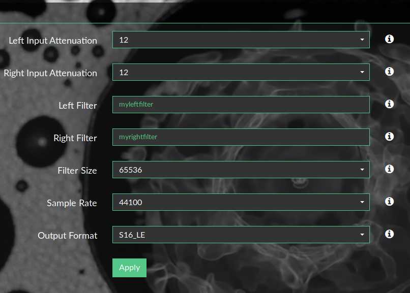

## Using filters in Volumio

Now it's time to test your filters. To do that :

* Place them in the shared folder of Volumio under `brutefirfilters`

* Then, in the pluign settings, select left and right filter

* Press apply and play what you want!

__Nota__ : In the true life, making a good filter is not so straight fowrad... You'll have to redo all the procedure many time to get a good result.
